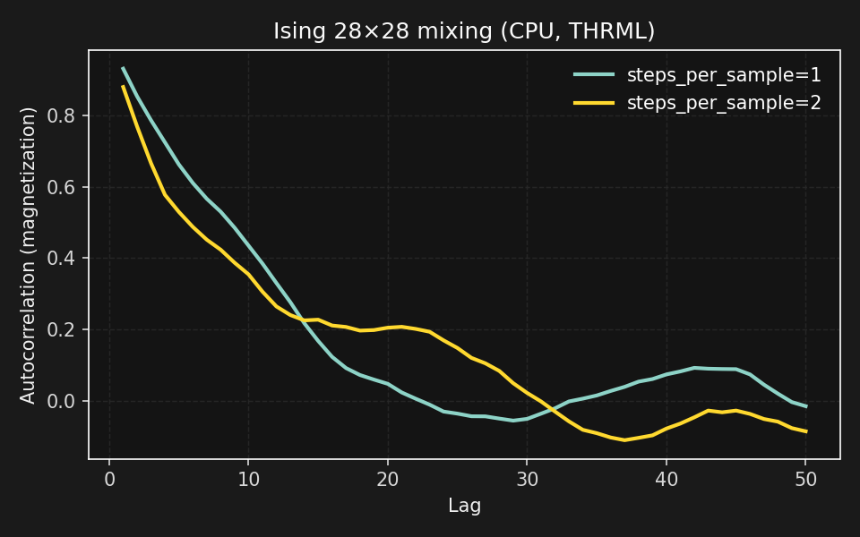
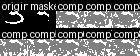
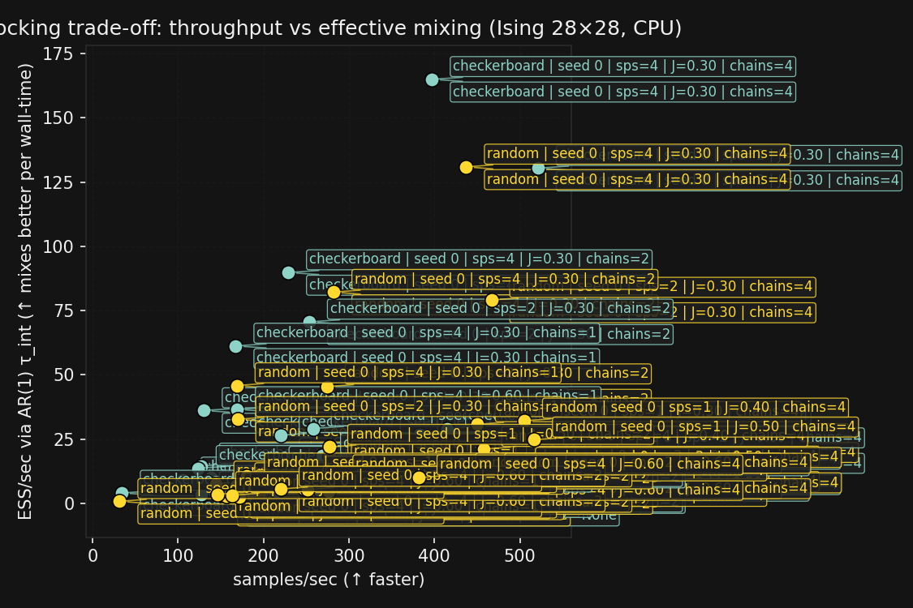
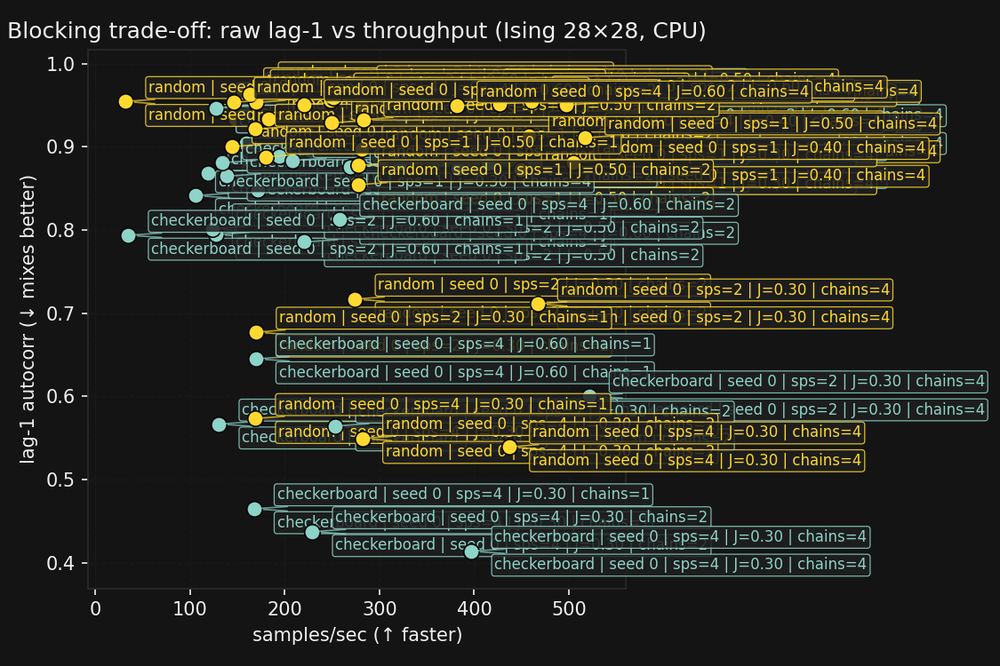
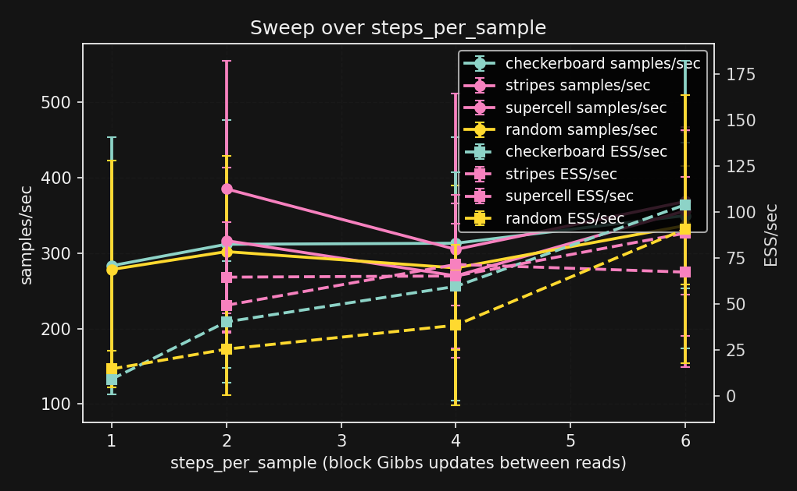
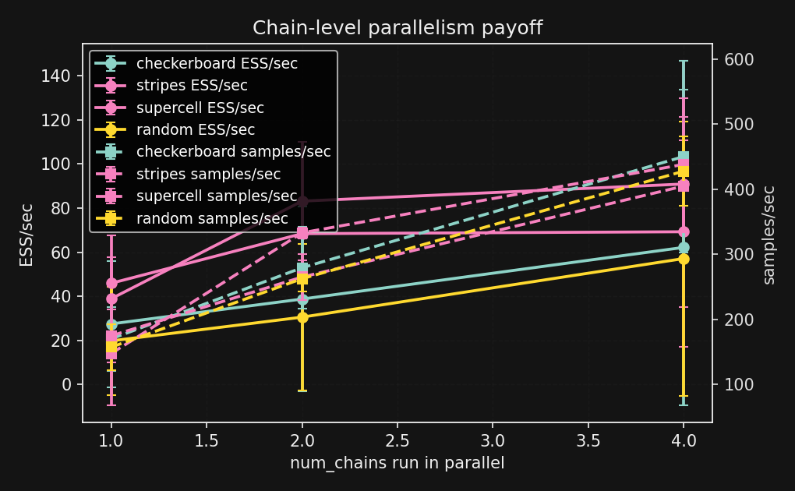
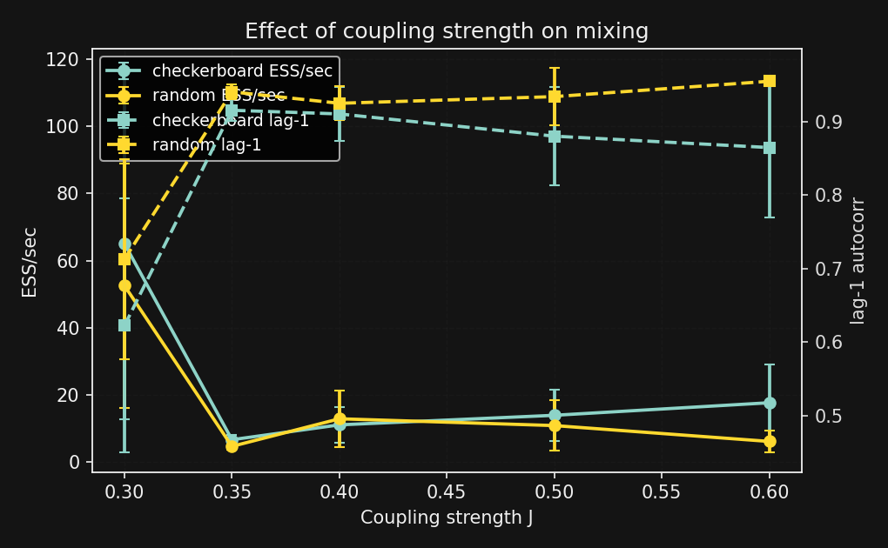

# THRML Speedrun (CPU → GPU)

> **Calling every anime pfp anon who thinks they're really smart: prove it.**  
> Make a thermo model in **THRML**, open-source your **benchmarks**, and help migrate ML to this new paradigm.  
> *Bounties + grants for Thermo ML community contributions are coming—make your PRs count.*

<p align="center">
  <br>
  
</p>

This repo is a **minimal, reproducible starting point** for thermodynamic ML (thermo/graphical EBMs) using **[THRML](https://docs.thrml.ai/)** + **JAX**:

- ✅ **Ising sampler** (28×28) with a 16-panel sample grid + a mixing GIF  
- ✅ **Mixing curves** showing the **steps_per_sample** trade-off  
- ✅ **Block ablation**: checkerboard vs random halves (throughput vs mixing)  
- ✅ **Conditional sampling (inpainting)** with clamped pixels
- ✅ **Unified bench harness** that emits JSON + figures for **throughput** and **effective mixing (ESS/sec)**

Everything here runs **CPU-only on WSL/Linux**, and the exact same code lifts to **GPU** (Dockerfile included).

---

## TL;DR (non-technical)

We play with a physics-inspired model where each pixel prefers to agree with its neighbors. We **sample** new images by flipping pixels in a smart way (Gibbs sampling). We measure how quickly the sampler **forgets the past** (mixing) and how **blocking choices** affect speed vs quality. We also **hide part of a digit** and ask the model to fill it in (*it restores local texture—this simple model doesn’t “know digits” yet*).

---

## High-level what’s going on (technical)

- **Model:** Discrete **Ising** energy-based model on a 2D grid (28×28). Spin variables in {−1,+1}; 4-neighbor couplings `J`.  
- **Sampler:** **Block Gibbs** in THRML. We compare **checkerboard** coloring vs **random halves**.  
- **Schedule:** `SamplingSchedule(n_warmup, n_samples, steps_per_sample)`. We vary **sps** (work per sample) and chart **autocorrelation of magnetization** as a mixing proxy.  
- **Conditional sampling:** Build **disjoint blocks** (free vs clamped), pass **boolean clamp values** for the masked pixels (THRML’s `SpinNode` expects bools), and sample the rest.
- **Bench metric:** Besides raw **samples/sec**, we compute an **ESS/sec** proxy via an AR(1) τ_int estimate:  
  `τ_int ≈ (1+ρ₁)/(1−ρ₁)`, `ESS/sec = (samples/sec)/τ_int`.

---

## Initial Results

- **Device:** CPU (JAX on WSL2).  
- **Quick bench:** 28×28, `warmup=100`, `n_samples=64`, `sps=1` → **~83 samples/s**.  
- **Ablation (same model):**  
  - *Checkerboard blocks:* **~159.3 samples/s**, lag-1 autocorr **0.905**  
  - *Random halves:* **~308.3 samples/s**, lag-1 autocorr **0.937**  
  → **Trade-off:** random halves are faster but **mix worse**; checkerboard respects lattice locality.  
- **Inpainting:** Center patch clamped from the real image; model restores **local texture** (not global digit semantics).

  
**Current bench scatter (auto-aggregated):**

<p align="center"> <br>  </p> 

**New: schedule + parallelism sweeps**

<p align="center">
  <br>
  <br>
  
</p>

**Per-run numbers (Ising 28×28, CPU):**

| blocking     | seed | samples/sec | lag-1 | τ_int(est) | ESS/sec |
|--------------|:----:|------------:|------:|-----------:|--------:|
| checkerboard | 0    | 159.39      | 0.905 | 20.05      | **7.95** |
| random       | 0    | 161.92      | 0.933 | 28.88      | 5.61 |
| checkerboard | 1    | 159.71      | 0.936 | 30.17      | 5.29 |
| random       | 1    | 158.94      | 0.955 | 43.21      | 3.68 |

**Takeaway:** At similar throughput, **checkerboard yields higher ESS/sec** (effective samples per wall-time) than random in our runs—~**1.4–2.2×** better depending on seed. And both **more steps-per-sample** and **more parallel chains** can raise ESS/sec (trustworthy progress per second).


Artifacts (generated by the scripts below) live in `outputs/`:
- `outputs/samples_ising.png` — 16 sampled grids  
- `outputs/mixing.gif` — a short chain evolving  
- `outputs/autocorr.png` — mixing curves (shown above)  
- `outputs/ablations.txt` — the throughput + autocorr numbers  
- `outputs/inpaint_collage.png` — conditional sampling collage (shown above)  
- `outputs/bench_*.json` — bench results per run  
- `outputs/bench_tradeoff_ess_20251030-204420.png`, `outputs/bench_tradeoff_20251030-204420.png`,  
  `outputs/bench_sps_trends.png`, `outputs/bench_chain_scaling.png`, `outputs/bench_J_sweep.png` — the plots above

---

## Quickstart

### A) CPU (WSL/Linux)

```bash
# 1) create venv (Ubuntu 24.04 uses Python 3.12)
sudo apt-get update && sudo apt-get install -y python3-venv git
python3 -m venv ~/.venvs/thrml && source ~/.venvs/thrml/bin/activate
pip install --upgrade pip wheel

# 2) install deps
pip install "jax[cpu]" thrml numpy pillow imageio matplotlib tqdm scikit-learn

# 3) from repo root, generate artifacts
python -m pipelines.sample_ising
python -m viz.autocorr_magnetization
python -m pipelines.ablations
python -m pipelines.inpaint_ising

# 4) benchmarks (emit JSON + plots)
python -m pipelines.bench --blocking checkerboard --seed 0 --out outputs/bench_chk_s0.json
python -m pipelines.bench --blocking random       --seed 0 --out outputs/bench_rand_s0.json
python -m pipelines.bench --blocking checkerboard --seed 1 --out outputs/bench_chk_s1.json
python -m pipelines.bench --blocking random       --seed 1 --out outputs/bench_rand_s1.json
python -m viz.plot_bench
```

> JAX picks devices automatically; on CPU you’ll see `Devices: [CpuDevice(id=0)]`.

### B) GPU (Docker, CUDA 12) — **same code, just faster**

```bash
# build on a GPU host (Linux or WSL with GPU pass-through)
docker build -t thrml:gpu -f docker/Dockerfile.gpu .
docker run --gpus all -it --rm -v $PWD:/workspace thrml:gpu bash

# inside the container
python -m pipelines.sample_ising
python -m pipelines.ablations
python -m pipelines.bench --blocking checkerboard --seed 0 --out outputs/bench_gpu_chk_s0.json
python -m pipelines.bench --blocking random       --seed 0 --out outputs/bench_gpu_rand_s0.json
python -m viz.plot_bench
```

---

## Repo layout

```
models/
  ising_grid.py         # THRML Ising model + grid factory (nodes, edges, blocks)
pipelines/
  sample_ising.py       # 16-panel grid + mixing GIF
  bench_cpu.py          # tiny throughput sanity
  bench.py              # unified benchmark (JSON + ESS/sec)
  ablations.py          # checkerboard vs random halves (speed vs lag1 autocorr)
  inpaint_ising.py      # conditional sampling (clamped center patch)
viz/
  autocorr_magnetization.py  # magnetization autocorr curves (sps sweep)
  plot_bench.py              # aggregations + plots from bench_*.json
docker/
  Dockerfile.gpu        # CUDA 12 + JAX wheels + THRML
outputs/
  ...                   # generated artifacts (png/gif/txt/json)
```

---

## Reproduce exactly (hyperparameters)

- **Ising sampler:** `J=0.35`, `beta=1.0`, 4-neighbor grid; blocks = checkerboard;  
  sampling: `n_warmup=200`, `n_samples=16`, `steps_per_sample=2`.  
- **Bench:** `warmup=100`, `n_samples=128`, `sps=1`.  
- **Mixing curves:** `steps=400`, compare `sps=1` vs `sps=2`, magnetization autocorr (lags 1–50).  
- **Block ablation:** 28×28, `warmup=100`, `steps=128`, `sps=1`; compare checkerboard vs random halves (same block count).  
- **Inpainting:** mask=`center_box` (half-size), clamp values are **bool** (SpinNode), `warmup=350`, `n_samples=8`, `sps=2`.

---

## When to reach for more compute

- Sweeping schedules/temperatures/graph colorings → a single **L4** is great (cheap, efficient).  
- Bigger EBMs (≥1–5M vars), lots of parallel chains, multi-stage DTM → **A100 40/80GB** or **L40S**.  
- Scaling studies (pmap/pjit across devices) → **4–8× A100/L40S** or **TPU v5e-8**.

**Small knobs that matter**

- Prefer **float32**; try **bfloat16** only after checking stability.  
- `XLA_PYTHON_CLIENT_PREALLOCATE=false` during dev to avoid grabbing all GPU memory.  
- Profile **steps_per_sample**, **n_warmup**, and **block sizes**—they dominate throughput/mixing.  
- Use **vmap** for many chains per device; step up to **pmap/pjit** only when one GPU is saturated.  
- On **WSL2**: keep NVIDIA drivers current; enable WSL GPU compute; run via Docker + `nvidia-container-toolkit` for least friction.

---

## “Hidden gold”: what we’re hunting

- **Block-Gibbs-friendly recipes** that **scale and mix fast**, and  
- **Proof via curves** (throughput, mixing, quality) that more **parallel local sampling** makes them better, and  
- A small set of reusable **schedules/clamping tricks** the community can remix.

---

## What to try next (PRs welcome)

1. **Potts (q-state) grids** with categorical nodes → colorful demos + better structure.  
2. **RBM-like bipartite EBM** (visible↔hidden) using THRML’s factorized EBM APIs.  
3. **Coarse→fine “DTM-style” chains:** downsample→upsample with clamping between stages.  
4. **Schedule sweeps:** `sps ∈ {1,2,4}`, J-sweeps, tempering/annealing; plot **ESS/sec vs samples/sec**.  
5. **Parallel chains:** `--num_chains` (vmap) and then multi-GPU with pmap/pjit.  
6. **Metrics:** pseudo-likelihood, correlation structure match, simple AIS.

> **Goal of the swarm:** discover **recipes** (blocks, schedules, clamping) and **model classes** that **mix fast** and **scale** with parallel local updates—perfect for probabilistic/thermodynamic hardware.

---

## Contributing (be the swarm)

- Open a PR with a **new variant or schedule**, include:
  - a script in `pipelines/` or `viz/`,
  - one **figure** in `outputs/`,
  - a small **`bench_*.json`** with your numbers (or `.txt` with the same keys),
  - a blurb in `README` or a new `docs/` page.
- Keep runs **small** (CPU-friendly) but meaningful.  
- If you add GPU results, include **samples/sec vs lag-k autocorr** or **ESS/sec** per wall-time.

---

## Acknowledgments

- Built with **THRML** (Thermodynamic HypergRaphical Model Library) and **JAX**.  
- Thanks to the Thermo ML community for the inspiration and the push to open benchmarks.

---

## License

MIT (code) — figures are yours to repost with attribution to this repo.
